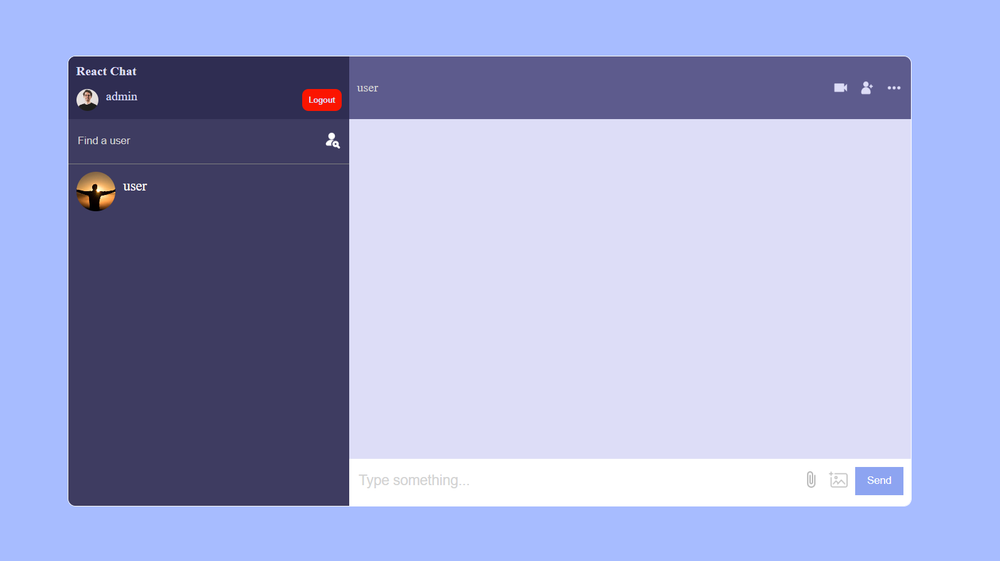
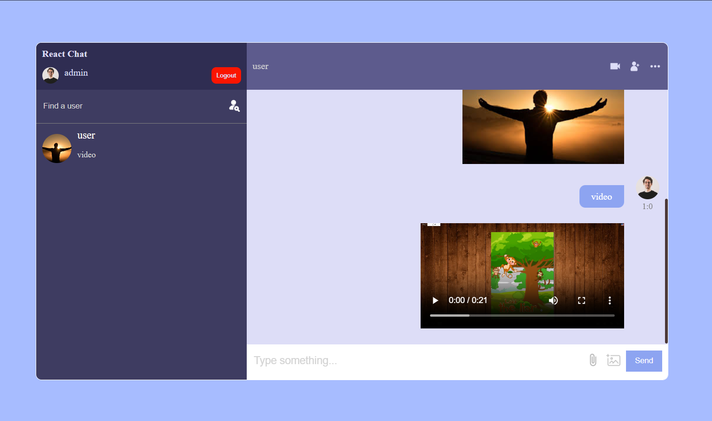

# React Chat App with Firebase Backend

This is a real-time chat application built using ReactJS with Firebase as the backend. The app allows users to register, upload profile images, search for other users, and engage in text, image, and video-based conversations.

## Features

- **User Authentication**: Users can create an account and log in securely using Firebase authentication.

- **Profile Image Upload**: During registration, users have the option to upload a profile image which will be displayed in the chat interface.

- **User Search**: Users can search for other registered users in the app.

- **Chat Management**: To initiate a chat, users need to search for and select a user. The selected user will then be added to the list of chats. Subsequently, clicking on a user's name in the chat list will open the chat interface.

- **Media Sharing**: Users can send images and videos through the chat interface.

## Technologies Used

- ReactJS
- React Hooks (useStates, useContext, useEffect, useReducer, useRef)
- SCSS (for styling and design)
- Firebase (Authentication, Firestore for database, Storage for media uploads)

## How to Run

1. Clone this repository to your local machine.
2. Navigate to the project directory using the command line.
3. Install dependencies using `npm install`.
4. Create a Firebase project and set up Firebase authentication and Firestore database. Update the Firebase configuration in the project.
5. Launch the app using `npm start`.

## Firebase Configuration

To set up Firebase for this project, you'll need to:

- Create a Firebase project [here](https://console.firebase.google.com/).
- Obtain your Firebase config object which contains API keys, authentication details, etc.
- Update the Firebase config object in `src/firebase.js` file.

## Screenshots

